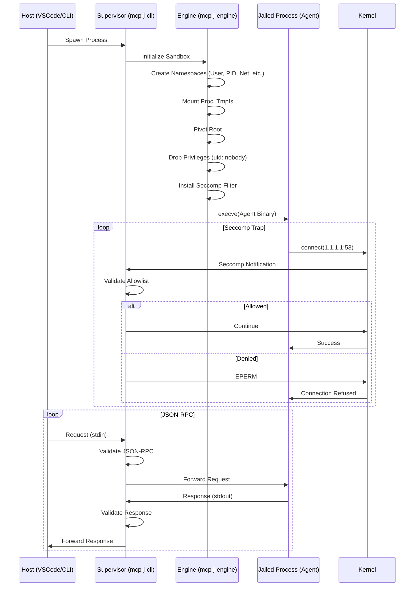

# MCP-J System Architecture

## Overview

MCP-J is a secure runtime for executing untrusted Model Context Protocol (MCP) agents. It enforces strict isolation using Linux kernel features (Namespaces, Cgroups, Seccomp, Landlock) while maintaining high-performance communication via a custom JSON-RPC proxy.

## Core Components

### 1. Supervisor (`mcp-j-cli`)
The Supervisor is the parent process responsible for:
- Creating the isolated environment (namespaces, mounts).
- Launching the jailed process.
- Installing the Seccomp BPF filter.
- Managing the lifecycle of the agent.

### 2. Sandbox Engine (`mcp-j-engine`)
The core library implementing the security primitives:
- **Namespaces**: Isolate PID, Mount, IPC, UTS, Net, and User namespaces.
- **Pivot Root**: Creates a minimal root filesystem (`pivot_root`) based on read-only bind mounts from the host.
- **Landlock LSM**: Restricts filesystem access within the jail to a default-deny policy.
- **Seccomp User Notification**: Intercepts `connect`, `bind`, and `execve` syscalls in user space for policy enforcement.

### 3. IPC Proxy (`mcp-j-proxy`)
A strict JSON-RPC 2.0 proxy that sits between the host (client) and the jailed agent (server).
- **Validation**: Ensures all messages adhere to the JSON-RPC 2.0 spec.
- **Sanitization**: Prevents malicious payloads or protocol abuse.
- **Framing**: Enforces strict `Content-Length` framing for reliable communication.
- **Multiplexing**: Separates `stdout` (JSON-RPC) from `stderr` (Logs/Diagnostics).

## Execution Flow

## Security Model

### Isolation Layers

1.  **Filesystem Jail**: The agent sees a constructed root with only minimal system directories (`/bin`, `/lib`, `/usr`).
2.  **User Namespace**: The agent runs as UID 0 inside the namespace but maps to `nobody` (UID 65534) on the host.
3.  **Network Namespace**: The agent has a loopback interface only. External network access is blocked by default and strictly controlled via Seccomp interception.
4.  **Cgroups**: Resource limits (memory, CPU) prevent DoS attacks.

### Syscall Interception

We use `SECCOMP_RET_USER_NOTIF` to intercept syscalls in user space. This allows the Supervisor to make complex policy decisions (e.g., DNS resolution, path validation) without modifying the kernel.

- **`connect`**: Checked against an allowlist of IP/Port combinations.
- **`execve`**: Checked against an allowlist of binaries.
- **`bind`**: Generally blocked to prevent the agent from listening on ports.

## VSCode Integration

The VSCode extension (`clients/vscode-mcp-j`) manages the Supervisor process. It handles:
- **Configuration**: User settings for memory limits, network allowances, and environment variables.
- **Lifecycle**: Starting/Stopping the Supervisor.
- **Transport**: Standard MCP transport over stdio.
